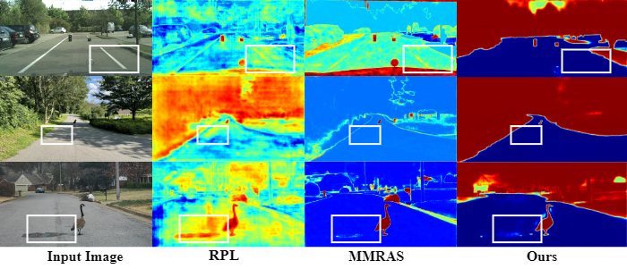
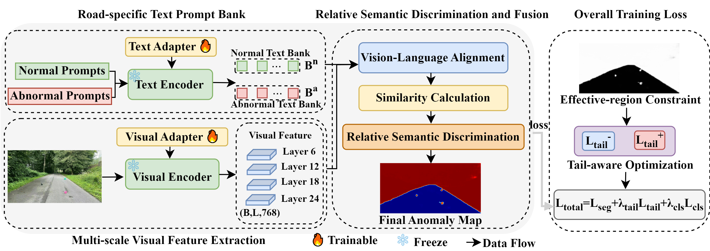

# 🚀 RSD-VL: A Relative Semantic Discrimination Vision-Language Model for Anomaly Detection in Autonomous Driving Scenes

This is the official implementation of **RSD-VL: A Relative Semantic Discrimination Vision-Language Model for Anomaly Detection in Autonomous Driving Scenes**.

<p align="center">
  
</p>

## Abstract

Accurate road anomaly detection is essential for autonomous driving safety, as it identifies unknown obstacles within drivable areas. However, existing methods often rely on visual responses or prediction confidence for anomaly detection, making them vulnerable to visual saliency bias introduced by pseudo-anomalous regions such as shadows, reflections, and lane markings. Such bias can cause normal road regions to be falsely detected as anomalies.

To address this problem, we propose **RSD-VL**, a relative semantic discrimination vision-language model for anomaly detection in autonomous driving scenes. Specifically, we construct a road-specific dual-branch prompt bank to establish a clearer semantic boundary between normal road regions and anomalous obstacles, thereby reducing high anomaly responses in pseudo-anomalous regions.

We further introduce a relative semantic discrimination mechanism that derives anomaly scores by comparing abnormal semantic responses with normal road semantic responses. By suppressing regions explainable by normal road semantics and highlighting true anomalies that lack sufficient normal semantic support, this mechanism improves anomaly localization accuracy.

In addition, we develop a safety-aware optimization strategy to alleviate irrelevant background interference and reduce the impact of extreme anomaly scores, leading to more reliable prediction. Experiments on RoadAnomaly, SMIYC-RO21, and Fishyscapes show that our method achieves high AP and AuROC while reducing false positives on several datasets.

## Framework

<p align="center">
  
</p>

## Installation

Clone this repository:

```bash
git clone https://github.com/Shirui2001/RSD-VL.git
cd RSD-VL
```

Create a conda environment with Python 3.9:

```bash
conda create -n rsdvl python=3.9
conda activate rsdvl
```

Install PyTorch 2.3.1 with CUDA 11.8:

```bash
pip install torch==2.3.1 torchvision==0.18.1 torchaudio==2.3.1 --index-url https://download.pytorch.org/whl/cu118
```

Install other required packages:

```bash
pip install -r requirements.txt
```

## Datasets

We have three different sets of dataset used for training, OOD fine-tuning, and anomaly inference. Please follow the below steps to set up each set.

- **Inlier Dataset (Cityscapes/Streethazard):** consists of only inlier classes that can be prepared by following the same structure as given [here](https://github.com/facebookresearch/Mask2Former/blob/main/datasets/README.md).

- **Outlier Supervision Dataset (MS-COCO):** helps fine-tune the model pre-trained on the inlier dataset on OOD objects. The outlier dataset is created by using [this script](https://github.com/robin-chan/meta-ood/blob/master/preparation/prepare_coco_segmentation.py) and then changing the `cfg.MODEL.MASK_FORMER.ANOMALY_FILEPATH` accordingly.

- **Anomaly Dataset (validation):** can be downloaded using this [link](https://drive.google.com/drive/folders/1eQhmPbKSZrN1AsieY9KFchfll7XC1_SF). Please unzip the file and place it preferably in the dataset folder.

## Training & Evaluation

```bash
# training
python train.py --shot $shot --save_path $save_path

# evaluation
python test.py --save_path $save_path --dataset $dataset

# Optional: we provide a bash script for training and evaluating all the datasets
bash scripts.sh
```

Model definition is in `./model/`. We thank [open_clip](https://github.com/mlfoundations/open_clip) for being open-source. To run the code, one has to download the weight of OpenCLIP ViT-L-14-336px and put it under `./model/`.

## Results

RSD-VL is evaluated on RoadAnomaly, SMIYC-RO21, Fishyscapes Static, and Fishyscapes Lost & Found. The proposed method achieves strong anomaly localization performance and effectively suppresses false positives caused by pseudo-anomalous regions such as shadows, reflections, lane markings, and road textures.

## Acknowledgements

We thank the authors of the codebases mentioned below, which helped build the repository.

- [Meta-OOD](https://github.com/robin-chan/meta-ood)
- [Mask2Former](https://github.com/facebookresearch/Mask2Former/tree/main)
- [AA-CLIP](https://github.com/Mwxinnn/AA-CLIP)

## Contact

If you have any questions, please contact the authors.
